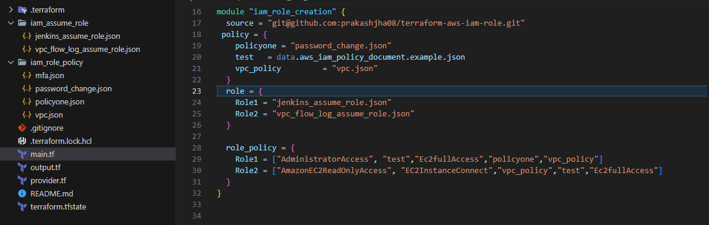

AWS IAM Terraform module
=====================================

I am Terraform module which will create IAM roles and policies on AWS.

Types of resources supported in IAM Role creation:

* [ AWS IAM Policy ] (https://registry.terraform.io/providers/hashicorp/aws/latest/docs/resources/iam_policy)
* [ AWS IAM Role] (https://registry.terraform.io/providers/hashicorp/aws/latest/docs/resources/iam_role)
* [ AWS IAM role policy attachment] (https://registry.terraform.io/providers/hashicorp/aws/latest/docs/resources/iam_role_policy_attachment)

Terraform versions
------------------

Terraform >=v0.14

---------------------------------------------------------------------------

Pre-requisite for calling IAM role module:

    Create a folder named "iam_assume_role" in the root folder which will contain the assume role json files. Also, create "iam_role_policy" folder in the root folder which will contain the policy json files.

Example:
<div align="center">

</div>


Calling module for iam role creation
-----------

Usage
----
```hcl
data "aws_iam_policy_document" "example" {
  statement {
    sid = "1"

    actions = [
      "s3:ListAllMyBuckets",
      "s3:GetBucketLocation",
    ]

    resources = [
      "arn:aws:s3:::*",
    ]
  }
}

module "iam_role_creation" {
  source = "git@github.com:prakashjha08/terraform-aws-iam-role.git"
  policy = {
    policyone  = "password_change.json"
    test       = data.aws_iam_policy_document.example.json
    vpc_policy = "vpc.json"
  }
  role = {
    Role1 = "jenkins_assume_role.json"
    Role2 = "vpc_flow_log_assume_role.json"
  }

  role_policy = {
    Role1 = ["AdministratorAccess", "test", "Ec2fullAccess", "policyone", "vpc_policy"]
    Role2 = ["AmazonEC2ReadOnlyAccess", "EC2InstanceConnect", "vpc_policy", "test", "Ec2fullAccess"]
  }
}

```
Inputs
------
| Name | Description | Type | Default | Required |
|------|-------------|------|---------|:--------:|
| role | Role name and assume role json to be passed | `map(any)` | `{}` | no |
| policy | To create custom IAM policies | `map(any)` | `{}` | no |
| role_policy | Policies to be attached to IAM roles. It is a map variable that should be written as Role_name = [List of policies] | `map(any)` | `{}` | no |


Output
------
| Name | Description |
|------|-------------|
| role_arn | The role ARNs |
